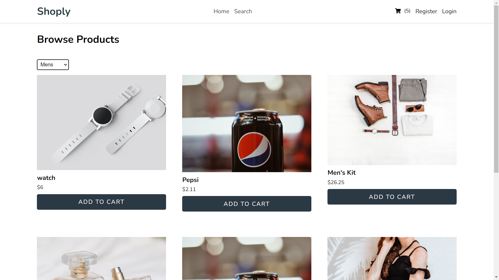

# Shoply - Featuring React.js, Firebase, Redux Saga, Material UI & Typescript

## The Challenge⚡️

I had the idea to build a fully functional eCommerce project using technologies that I liked. That's when I found this great course by [@SimpleTut](ttps://www.youtube.com/@SimpleTut) on Youtube. I immediately found interest in his teaching style and started this project.

I changed a couple of things from the course, such as using `typescript` instead of `javascript` and `scss` for styling.

This is a great repo if you want to get started with integrating `Redux Saga` with typescript and `React.js`.

Here was the challenge:

- Storing products, users, and orders in firebase cloud firestore.
- Using a strict & consistent folder architecture.
- Implementing a cart system using client-side logic.
- Handling CRUD operations with firebase, using Redux Saga.
- Creating a good harmony between React, Redux and Typescript.

## Built With ✨

- [Firebase](https://firebase.google.com/)
- Redux Saga, Redux Persist
- [Material UI](https://mui.com/) - UI library
- [React](https://reactjs.org/) - JS library
- Typescript

## Author

- [@achrafdev](https://achrafdev.com)

**Thanks for sharing** 🚀
